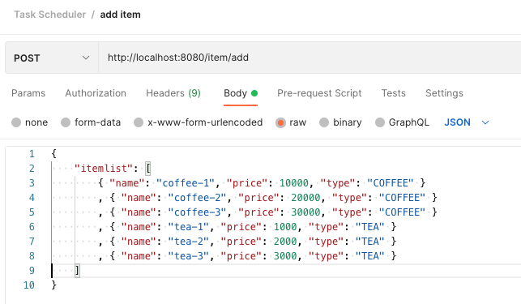

# ondif-tools-taskscheduler
This sample code is used to run the scheduler for a certain period of time in a task method.

## About

This program is just for saving samples.

## Technology Stack

Component               | Technology
---                     | ---
Task Scheduler          | ThreadPoolTaskScheduler
ORM                     | JPA
database                | H2


## Quick start

**Run Environment: Java 11, Maven


**Clone this project**

```bash
git clone https://github.com/algor37/springboot-task-scheduler
```

**Build**

```bash

```

## TEST
1. add items




2. add coffee scheduler


3. remove coffee scheduler


4. h2 database

http://localhost:8080/h2-console/


# ToDo List
- [ ] [] xxx : 2022.xx.xx 


# History

```
- 2022.06.04
        1. create project
        2. v0.1.0 release.
        3. comment
- 2022.06.14
        1. modify scheduler properties
```

### Release
- v0.1.0 https://github.com/algor37/springboot-task-scheduler/releases/tag/v0.1.0


## Copyright and license

The code is released under the MIT license.